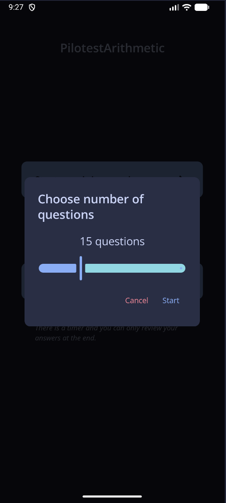
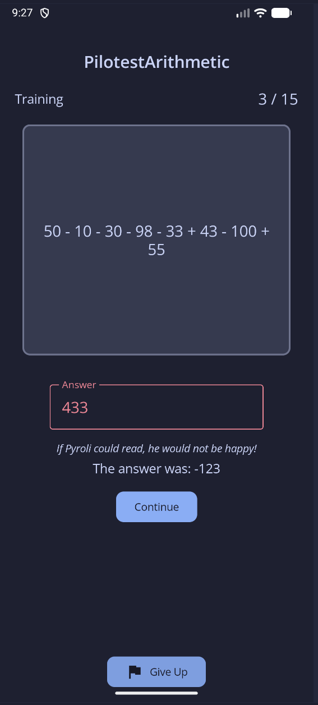
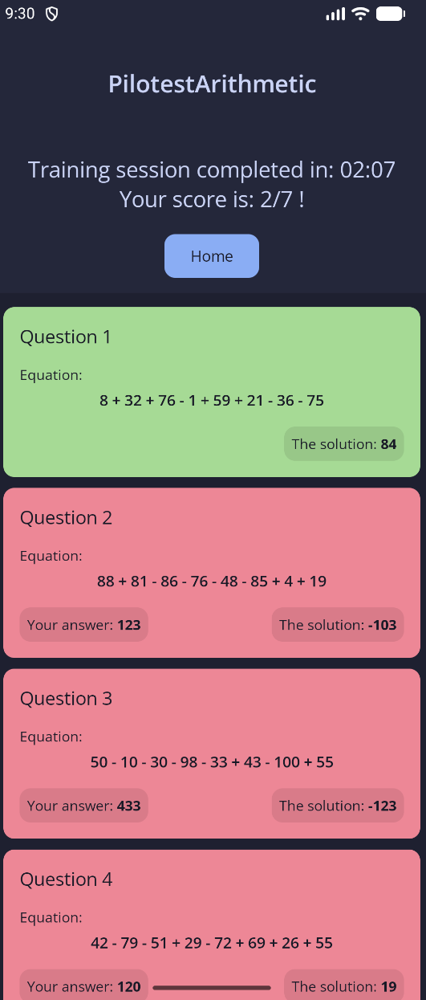

# Pilotest Arithmetic

Pilotest Arithmetic is an android application tailored for mind calculus training.

It is based on the so-called tests [Pilotest](https://www.pilotest.com/fr) - tests taken in order
to become an airline pilot. The application has primarily been developed to help out a friend
who trains for passing these tests.

## Overview

The application allows the user to select between two modes:

- Training mode: the user has infinite time to solve a chosen number of sum, with answers at each question;
- Exam mode: the user has 10 minutes to solve 20 sums. Also, answers are given at the very end.

Independently of the mode, the session ends on a result screen that summarizes all equations, user
answers and the correct ones.

The application is simple, useful and efforts have been made in the UI/UX (discover by yourself with
the screenshots below :)).

</img>
</img>
</img>
</img>

>Fun fact: Pyroli is the name of my cat, hence the playful message when failing

## Build for release

To build in release mode, one should generate its keystore in order to sign the generated `.apk`.
Once generated, the keystore is associated to a *key alias*. Both are protected by password.

All these necessary information are specified through the `signing.properties` file. This file is
**mandatory** in order to build the application in release mode.

An example version of this file can be found at [signing.properties.example](signing.properties.example)
with placeholder values.

```text
// signing.properties.example

storeFilePath=<path/to/your/keystore>
keyAlias=<your-key-alias>
storePassword=<your-password>
keyPassword=<your-password>
```

All four variables must be defined.

## Feedback

If you notice any problem with the application or encounter any bugs, feel free to open an issue. I
would be glad to look into it :)
